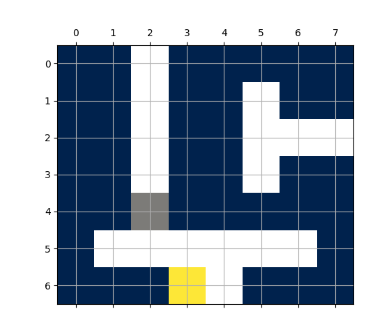

# Reinforcement Learning (EL2805)
With the development of Google's AlphaGo Zero, the research field of reinforcement learning (RL) gained significantly in
popularity. The possibilities of applying reinforcement learning are endless, and it represents therefore
a powerful framework to improve a system's behaviour in a defined and set environment. KTH offers classes in RL, and
this repository contains the code for the assignments and labs of the course EL2805. The scripts were implemented
in collaboration with [Adrian Chmielewski-Anders](https://github.com/adrianc-a)

## Requirements
The Python code requires Python 3 (ideally Python3.6 or higher). Moreover, to install the requirements, we recommend
having pip installed. Run
```bash
python3 -m pip install -r requirements.txt
```
to download and set up the necessary libraries and modules.

## Lab 1
The first assignment covered the formulation of Markov decision problems (MDPs) and the implementation
of Bellman's equation with and without finite time horizon. In a first gamified setup, the objective was to identify
a strategy to escape the minotaur's maze before eating you. Whilst the minotaur can walk through walls, you yourself can't.
A screenshot of such a scenario is given below. White squares represent the walls, grey is the game's agent,
yellow the minotaur. Blue squares are possible positions for the agent.



To execute the code, run
```bash
python3 lab1/maze.py
```
Note: in this script, we implemented several main functions for different tasks. Comment out/in whatever you 
need before running the command.

Whilst the first setup had an enemy that moves completely randomly (every position next to the minotaur is equally likely),
the second problem defined a cops-and-robbers game with your enemy (the police) moving randomly but
in your direction. The goal of this task was to compare the Q-learning with the SARSA algorithm.

To execute the code, run
```bash
python3 lab1/bank_reloaded.py
```
Note: the script contains one main function for Q-learning and one for SARSA. Comment out/in whatever algorithm 
you'd like to try out.

The lab's report is added to the lab1 folder.

## Lab 2
In a real-life scenario, the action and/or state-space is often virtually infinite. Thus, classic RL approaches, as
the ones Lab 1, are not sufficient anymore. Deep reinforcement learning (or Deep Q learning in this particular case)
creates remedy and was used in Lab 2 to solve the Cartpole benchmark problem. The provided training platform made 
use of the CartPole-v0 simulator, which is part of the gym library; a reinforcement learning research platform
provided by OpenAI. The goal of this assignment was to evaluate the impact of certain parameters in the system's 
performance.

To execute the code, run
```bash
python3 lab2/cartpole_dqn.py
``` 
Note: the main function contains code commented out for different experimental setups. Comment out/in whatever you 
need and you're interested in.

The lab's report is added to the lab2 folder.